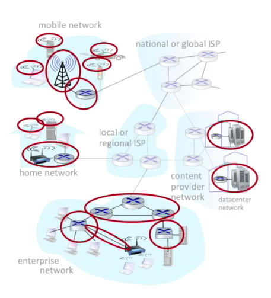
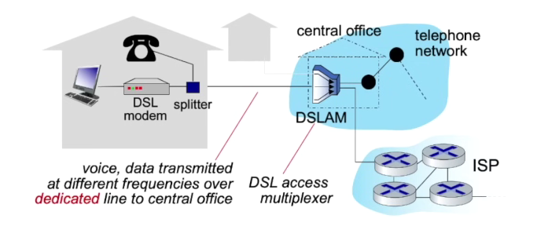
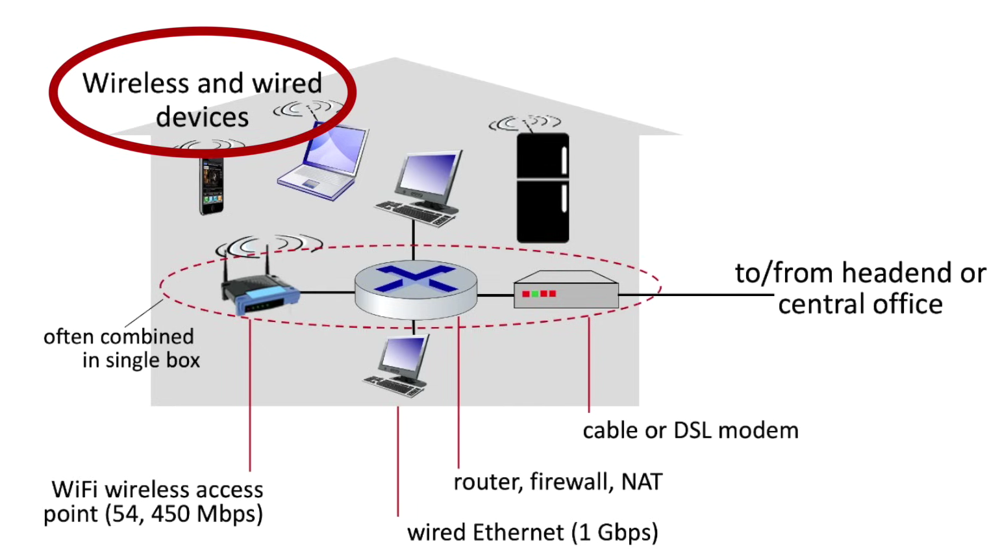
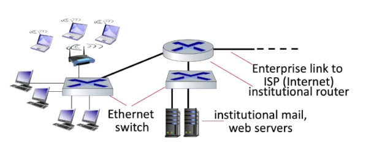
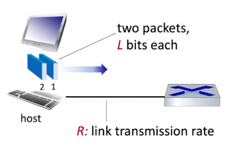

## Access Network

Definition: 
The network layer that connected directly to end devices, provides connectivity to the core network.

1. Cable-based access network

- Up to 40 Mbps - 1.2 Gbs for downstream transmisison; 30 - 100 Mbps for upstream transmission

2. Digital Subscriber Line (DSL) access network

Basically, using the existing phone line to transmit packet data

- 24 - 52 Mbps for downstream transmisison; 3.5 - 16 Mbps for upstream transmission

3. Home LAN

The DSL modem, router, and access point often combine into 1 box

4. Wireless access network

- WLANs - Wireless Local Area Network

    - 11,54 upto 540 Mbps

- Wide-area Cellular access network

    - Example: 3G, 4G and 5G provider
    - About 10 Mbps

5. Enterprise access network

Including multiple switches and routers
- Ethernet: wired access at 100Mbps, 1Gbps, 10Gbps
- WiFi: wireless access points at 11, 54, 450 Mbps

---

## Bit and transmission rate

- Breaks into smaller chunks, known as packets, of length `L` bits 

- Transmits packet into access network at transmission rate `R` link transmission rate, aka link capacity, aka link bandwidth

---

## Links: Physical media

Between transmitter and receiver, `bit` is propagated. Through 2 types of media:
- Guided media (e.g. fiber optic,...)
- Uniguided media (e.g. redio,..)

